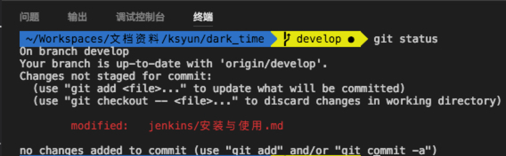

# Visual Studio Code 的使用

[TOC]

## 插件
>插件的快捷键配置、使用说明都在的首页中

- JSON Tools (eriklynd.json-tools)  
Tools for manipulate JSON. You can pretty/minify JSON with this extension.
- Git History (git log) (donjayamanne.githistory)  
View git log along with the graph and details.
- REST Client (humao.rest-client)  
REST Client allows you to send HTTP request and view the response in Visual Studio Code directly.
- SQL Beautify (sensourceinc.vscode-sql-beautify)  
格式化sql，人气较低，不太好用

## 个性化设置
### 首选项-设置
>VSCode的设置是json形式的配置，做了图形化显示，设置分为用户设置和工作区设置，工作区设置就是保存在当前工作区的`settings.json`，用户设置则是全局的。自定义的设置是一个新的json配置文件，里面的配置会覆盖系统默认配置文件，所以不用担心修改错了东西而改不回去

``` json
// 一个示例用户设置
{
    "rest-client.environmentVariables": {
        "local": {
            "host": "localhost",
            "token": "test token"
        },
        "production": {
            "host": "example.com",
            "token": "product token"
        }
    },
    "terminal.integrated.fontFamily": "'Meslo LG L DZ for Powerline'",
    "workbench.activityBar.visible": true,
    "java.errors.incompleteClasspath.severity": "ignore",
    "workbench.iconTheme": "vs-seti",
    "files.autoGuessEncoding": false,
    "workbench.editor.closeOnFileDelete": false
}
```

- terminal.integrated.fontFamily  
调整终端的字体，如果之前使用了oh-my-zsh的终端主题，该主题使用了Powerline的字体（有一些特殊符号），所以在vsCode集成的终端控制台也应该修改字体


- "files.hotExit": "onExit"  
是否允许热退出，即文件未保存的情况下也可以退出编辑器，下次打开会恢复，默认是允许的。


### 首选项-键盘快捷方式
> 键盘快捷键设置也是json格式，与系统设置原理一样，默认打开是图形化见面，但是可以进入`高级自定义`修改`keybindings.json`文件
> 这里除了定义系统按键也可以定义插件（json设置中以extesion前缀）的按键设置，当然 插件的快捷键也可以在插件的首页里进行配置更为清晰

``` json
// 一些自定义的按键设置
[
    {
        "key": "cmd+/",
        "command": "editor.action.triggerSuggest",
        "when": "editorHasCompletionItemProvider && editorTextFocus && !editorReadonly"
    },
    {
        "key": "ctrl+/",
        "command": "editor.action.commentLine",
        "when": "editorTextFocus && !editorReadonly"
    },
    {
        "key": "ctrl+d",
        "command": "editor.action.deleteLines",
        "when": "editorTextFocus && !editorReadonly"
    },
    {
        "key": "cmd+alt+l",
        "command": "editor.action.formatDocument",
        "when": "editorHasDocumentFormattingProvider && editorTextFocus && !editorReadonly"
    },
    {
        "key": "cmd+d",
        "command": "editor.action.copyLinesDownAction",
        "when": "editorTextFocus && !editorReadonly"
    },
    {
        "key": "ctrl+cmd+j",
        "command": "extension.prettyJSON"
    },
    {
        "key": "ctrl+cmd+m",
        "command": "extension.minifyJSON"
    }
]
```

