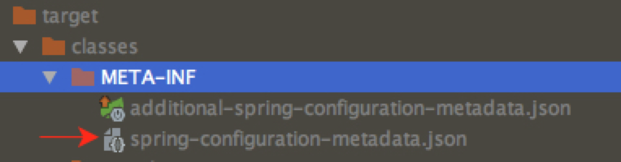
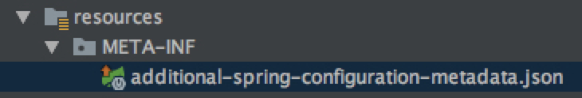

# spring boot 配置文件

## @ConfigurationProperties

参考配置

```java
@Configuration
public class MailNotifyConfiguration {
    @Configuration
    @ConditionalOnProperty("mail.server-url")
    @AutoConfigureBefore({AdminServerNotifierAutoConfiguration.NotifierTriggerConfiguration.class, AdminServerNotifierAutoConfiguration.CompositeNotifierConfiguration.class})
    public static class MailNotifierConfiguration {
        private final ApplicationContext applicationContext;

        public MailNotifierConfiguration(ApplicationContext applicationContext) {
            this.applicationContext = applicationContext;
        }

        @Bean
        @ConditionalOnMissingBean
        @ConfigurationProperties("notify.mail")
        public MailServerNotifier mailNotifier(InstanceRepository repository) {
            return new MailServerNotifier(emailSender(), repository, mailNotifierTemplateEngine());
        }

        @Bean
        @ConfigurationProperties("mail")
        public EmailSender emailSender() {
            return new EmailSender();
        }
        @Bean
        public TemplateEngine mailNotifierTemplateEngine() {
            SpringResourceTemplateResolver resolver = new SpringResourceTemplateResolver();
            resolver.setApplicationContext(this.applicationContext);
            resolver.setTemplateMode(TemplateMode.HTML);
            resolver.setCharacterEncoding(StandardCharsets.UTF_8.name());

            SpringTemplateEngine templateEngine = new SpringTemplateEngine();
            templateEngine.addTemplateResolver(resolver);
            return templateEngine;
        }
    }
}
public class EmailSender{
    private String serverUrl;
     public String getServerUrl() {
        return serverUrl;
    }

    public void setServerUrl(String serverUrl) {
        this.serverUrl = serverUrl;
    }
    //省略代码...
}
```

```properties
# 对应的配置文件
mail.server-url=http://server.com/mail/sendMail
notify.mail.enabled=true
notify.mail.to=exapmle@example.com
notify.mail.cc=exapmle@example.com
notify.mail.ignore-changes=
notify.mail.additional-properties.kbi_env=default
```

## 配置提示 配置元数据

### 描述

Spring Boot jar包含元数据文件，提供所有支持的配置属性的详细信息。这些文件旨在允许IDE开发人员在用户使用application.properties 或application.yml文件时提供上下文帮助和“代码完成”
元数据文件位于 jar包中的 META-INF/spring-configuration-metadata.json

### 自动生成

spring 提供了工具来帮助自动生成元数据，仅需引入依赖既可：

>You can easily generate your own configuration metadata file from items annotated with @ConfigurationProperties by using the spring-boot-configuration-processor jar. The jar includes a Java annotation processor which is invoked as your project is compiled. To use the processor, include a dependency on spring-boot-configuration-processor.
https://docs.spring.io/spring-boot/docs/2.0.4.RELEASE/reference/html/configuration-metadata.html#configuration-metadata-annotation-processor

生成的元数据文件存放在 META-INF/spring-configuration-metadata.json


注意：
spring会识别`@ConfigurationProperties`注解的类，类中的属性必须有get方法才能给识别出来生成元数据

### 配置元数据

除了自动生成的元数据之外,也可以自己编写元数据，
在`resource`目录下创建`META-INF/additional-spring-configuration-metadata.json`


配置详解参考：
[配置元数据 - CSDN博客](https://blog.csdn.net/L_Sail/article/details/70342023)
[Spring Boot的附录：附录B. 配置元数据](https://www.breakyizhan.com/springboot/3490.html)