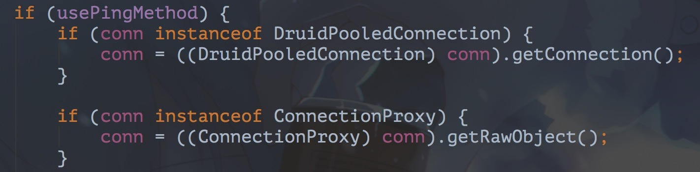

# druid使用

## 连接申请超时设定

配置参数为：

 ``` xml
   <!-- 配置获取连接等待超时的时间 单位是毫秒 -->
   <property name="maxWait" value="10000"/>
   <property name="validationQuery" value="SELECT 'x'"/>
   <property name="validationQueryTimeout" value="2"/>
 ```

在1.0.23版本中，mysql的连接超时判断的方法还未被调用，超时时间的参数配置无效。
推荐升级到目前主流版本 1.0.29，在该版本，mysql的超时检测方法已被重载，要注意时间参数的单位为秒。 而且默认并不会调用validationQuery参数配置的sql语句，默认是使用ping的方式检测，ping检测方法也可以关闭 `-Ddruid.mysql.usePingMethod=false`


`validationQueryTimeout`是用来配置查询SQL的超时时间的，但是超时后会继续重试，而不是报错。`maxWait`参数才是真正确定了申请连接的超时时间，当一个申请连接操作达到`maxWait`指定的时间后便会抛出错误


