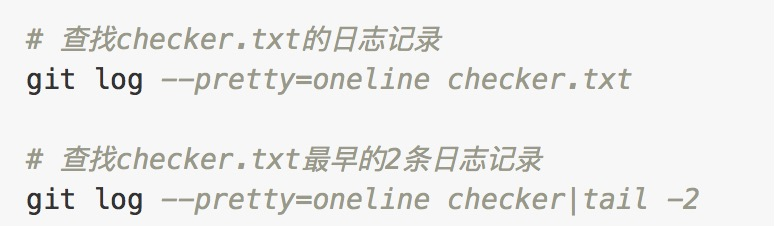

# git使用总结

Git global setup

```bash
git config --global user.name "username"
git config --global user.email "example@example.com"
```

Create a new repository

```bash
git clone http://github.com/example/example.git
cd example
touch README.md
git add README.md
git commit -m "add README"
git push -u origin master
```

Existing folder or Git repository

```bash
cd existing_folder
git init
git remote add origin http://github.com/example/example.git
git add .
git commit
git push -u origin master
```

---
查看历史记录


---
Git比较两个分支间所有变更的文件列表
`git diff branch1 branch2 --stat`
加上 --stat 是显示文件列表, 否则是文件内容diff

---
清理git目录
[Git - git-clean Documentation](https://git-scm.com/docs/git-clean)

删除 untracked files
`git clean -f`

连 untracked 的目录也一起删掉
`git clean -fd`

加`-n`参数不实际删除只显示会删除的文件，删除前加这个参数看一下会删除什么
`git clean -nfd`

连 gitignore 的untrack 文件/目录也一起删掉 （慎用，一般这个是用来删掉编译出来的 .o之类的文件用的）
`git clean -nxfd`

---
fork的项目 同步源项目代码
[Fork A Repo - User Documentation](https://help.github.com/articles/fork-a-repo/)
[Syncing a fork - User Documentation](https://help.github.com/articles/syncing-a-fork/)

---
git配置多个远程仓库
[git push如何至两个git仓库 - SegmentFault 思否](https://segmentfault.com/q/1010000000646988)
[准备更换git托管，如何迁移原git仓库 - SegmentFault 思否](https://segmentfault.com/q/1010000000124379)
[git本地仓库关联多个remote,怎么用本地一个分支向不同remote不同分支推送代码？ - 知乎](https://www.zhihu.com/question/46543115)

配置如下
```
[core]
        repositoryformatversion = 0
        filemode = true
        bare = false
        logallrefupdates = true
        ignorecase = true
        precomposeunicode = true
[remote "origin"]
        url = git@github.com:example/example.git
        fetch = +refs/heads/*:refs/remotes/origin/*
        pushurl = git@git.coding.net:example/example.git
        pushurl = git@github.com:example/example.git
[branch "master"]
        remote = origin
        merge = refs/heads/master
[user]
[submodule "themes/next"]
        url = git@github.com:example/example.git
        active = true
[remote "coding"]
        url = git@git.coding.net:example/example.git
        mirror = true
```

解释

1.执行 `git remote add --mirror=push coding git@git.coding.net:example/example.git`
添加一个镜像仓库，用来备份数据，相当于执行`git push--mirror`，会以镜像的方式把数据包括所有分支和历史的commit提交到目标仓库，**会强制覆盖远程仓库的数据**
2.执行

```bash
git remote set-url origin --push --add git@git.coding.net:example/example.git
git remote set-url origin --push --add git@github.com:example/example.git
```

设置`origin`的pushurl为这两个远程仓库url，当设置了`pushurl`之后便不会再使用`url`作为默认的pushurl了，所以一定要把两个都设置上

按上面步骤配置好后，先执行`git push coding`把本地代码镜像到coding仓库
修改文件之后只需要正常的执行`git push`便会向两个目标仓库都推送一遍。

不推荐在镜像仓库修改文件，但是如果真的在镜像仓库修改了文件而需要同步到原始仓库，那么先`git pull coding`获取镜像仓库的最新代码，然后`check out origin master` ,然后在merge代码过来。具体可以借鉴[Syncing a fork](https://help.github.com/articles/syncing-a-fork/)GitHub官网的fork代码同步的操作步骤，

常用命令

```bash
git clone <repository> --recursive #递归的方式克隆整个项目
git submodule add <repository> <path> #添加子模块
git submodule init #初始化子模块
git submodule foreach [command] #遍历进入每一个子模块，执行命令 如
git submodule foreach git pull #遍历进入每一个子模块，执行 git pull
```

## git的本地仓库和服务器仓库/裸库

简单总结就是：
不加`--bare`参数得到的仓库（无论是`init`还是`clone`操作），是一个包含工作空间的仓库，可以修改工作空间内容后提交。
加`--bare`参数得到的是不包含工作空间的裸库，因此无法直接修改工作文件。一般是作为远端中心仓库或者说服务器仓库存在的。工作人员从该裸库clone到本地后进行工作然后提交到仓库。

参考：
[服务器上的 Git|git-scm](https://git-scm.com/book/zh/v1/%E6%9C%8D%E5%8A%A1%E5%99%A8%E4%B8%8A%E7%9A%84-Git)
[Git 本地仓库和裸仓库 - TaoBeier - SegmentFault 思否](https://segmentfault.com/a/1190000007686496)
[搭建Git服务器](https://www.liaoxuefeng.com/wiki/0013739516305929606dd18361248578c67b8067c8c017b000/00137583770360579bc4b458f044ce7afed3df579123eca000)

详解：
通过 `git init`命令可以创建一个本地仓库
本地仓库具备了git的版本控制，可以进行文件修改和`commit`仓库，
如果`git remote add origin [gitUrl]`之后还可以push到远程仓库，

而通过`git init --bare`则是创建的一个裸库
也可以理解为是服务器仓库，该仓库没有工作空间，也就是用户无法直接在该仓库编辑工作文件，只能通过clone下来后进行文件修改然后commit、push。
所以`git init --bare`是创建一个git服务器的过程，`git clone --bare [projectUrl] newProjectRepo`则是克隆一个仓库作为新的服务器仓库/裸库（没有工作空间的仓库）的操作，
测试`git clone [projectUrl] newProject`这样clone下来的是一个projectUrl的本地工作空间，

## git版本号

[语义化版本](https://semver.org/lang/zh-CN/)

版本格式：主版本号.次版本号.修订号，版本号递增规则如下：

主版本号：当你做了不兼容的 API 修改，
次版本号：当你做了向下兼容的功能性新增，
修订号：当你做了向下兼容的问题修正。
先行版本号及版本编译信息可以加到“主版本号.次版本号.修订号”的后面，作为延伸。

## 使用技巧

### 删除某个文件的所有历史

不小心提交了敏感信息，并且已经push了很多个版本，可以用这种方式删除该文件/文件夹的所有历史记录。  
参考：[Git如何永久删除文件(包括历史记录) - shines77 - 博客园](https://www.cnblogs.com/shines77/p/3460274.html)  
[Git 永久删除文件 - BananaTree - CSDN博客](https://blog.csdn.net/lwfcgz/article/details/49453375)  
如果你要删除的目标不是文件，而是文件夹，那么请在 `git rm --cached' 命令后面添加 -r 命令，表示递归的删除（子）文件夹和文件夹下的文件  

```bash
git filter-branch --force --index-filter 'git rm --cached --ignore-unmatch path-to-your-remove-file' --prune-empty --tag-name-filter cat -- --all
git push --all --force

rm -rf .git/refs/original/
git reflog expire --expire=now --all
git gc --prune=now
git gc --aggressive --prune=now
```

如果是github上的仓库，历史文件还可以通过url访问到。可以git clone --bare 下载裸库后，删除github的仓库，然后重新 git push --mirror

[清除 git 上某个文件的历史 - 安金龙的修炼之路 - CSDN博客](https://blog.csdn.net/smile0198/article/details/50989418)

### 使用rebase来解决多人协作时出现多余的merge问题

在多人协作开发中，非常容易出现的问题就是时间线导致的系统自动创建的merge commit记录。  
A在Bpush代码后，进行push操作时，因为两人的commit记录时间线问题，导致必须先进行本地合并，会产生一条合并操作的commit记录，即使其实并没有代码冲突。  
在这种情况下，只要再执行一下`git rebase`就会调整commit记录的顺序，将本地的尚未push的commit记录放在远程分支的最末端(即origin/brach 的HEAD)。  

**与pull一起进行**
除了这种在产生merge记录后进行rebase来修正这种方式之外，也可以在pull代码的时候直接执行`git pull --rebase`来在pull的同时直接进行rebase操作。
**使用配置**
如果想要更方便可以配置`git config pull.rebase true` 这样pull的时候就可以直接做rebase操作了。
也可以单独指定某个分支，`git config branch.master.rebase true` 来单独配置某个分支。

参考 ： [Rebase](https://www.liaoxuefeng.com/wiki/0013739516305929606dd18361248578c67b8067c8c017b000/0015266568413773c73cdc8b4ab4f9aa9be10ef3078be3f000)   [聊下git pull --rebase - 王清培 - 博客园](https://www.cnblogs.com/wangiqngpei557/p/6056624.html)  

### clone一个仓库 复制一个仓库

```bash
set -ex
#拉取裸库
git clone --bare http://git.server.com/user/repo.git
cd repo.git

#推送加上 --mirror 采用镜像方式覆盖
git push --mirror http://git.server.com/user2/repo.git 

#也可以采用更保险的推送所有分支，防止覆盖目标仓库代码
#git push --all http://git.server.com/user2/repo.git

```

>[Git push --all vs --mirror](https://stackoverflow.com/questions/49343025/git-push-all-vs-mirror)
--all
Push all branches (i.e. refs under refs/heads/); cannot be used with other < refspec>.
--mirror
... specifies that all refs under refs/ (which includes but is not limited to refs/heads/, refs/remotes/, and refs/tags/) be mirrored ...

## 参考

[git忽略已经被提交的文件 - SegmentFault](https://segmentfault.com/q/1010000000430426)

[使用Git  Submodule管理子模块](https://segmentfault.com/a/1190000003076028)
[Git Submodule管理项目子模块 - nicksheng - 博客园](https://www.cnblogs.com/nicksheng/p/6201711.html)

[git 放弃本地修改 - 上官云清 - 博客园](https://www.cnblogs.com/qufanblog/p/7606105.html)
[git reflog 记录所有历史操作-版本回退](https://www.liaoxuefeng.com/wiki/0013739516305929606dd18361248578c67b8067c8c017b000/0013744142037508cf42e51debf49668810645e02887691000/)
