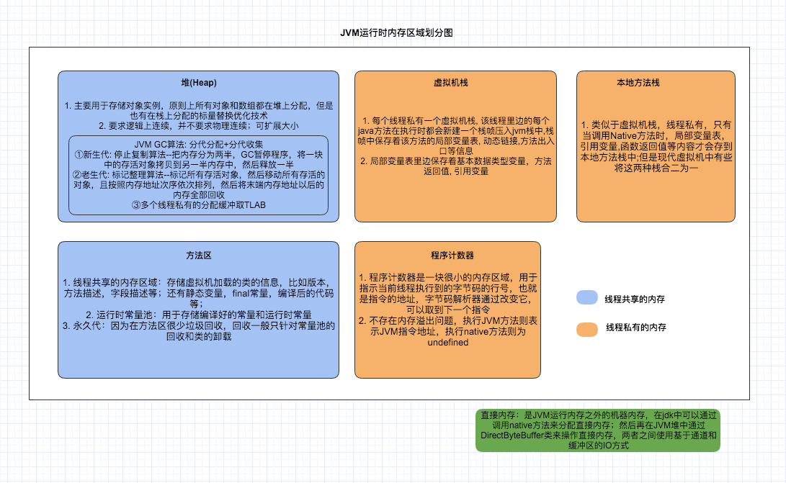

# java

## 使用Java 8中的Stream

[使用Java 8中的Stream - 随风逝去,只是凋零 - 博客园](https://www.cnblogs.com/zxf330301/p/6586750.html)

### reduce

`reduce(accumulator)` ：参数是一个执行双目运算的 Functional Interface ，假如这个参数表示的操作为op，stream中的元素为x, y, z, …，则 reduce() 执行的就是 x op y op z ...，所以要求op这个操作具有结合性(associative)，即满足： (x op y) op z = x op (y op z)，满足这个要求的操作主要有：求和、求积、求最大值、求最小值、字符串连接、集合并集和交集等。另外，该函数的返回值是Optional的：

```java
Optional <integer>sum1 = numStream.reduce((x, y) -> x + y);
```

`reduce(identity, accumulator)` ：可以认为第一个参数为默认值，但需要满足 identity op x = x ，所以对于求和操作， identity 的值为0，对于求积操作， identity 的值为1。返回值类型是stream元素的类型：

```java
Integer sum2 = numStream.reduce(0, Integer::sum);
```

reduce 如果不加参数`identity`则返回的是optional类型的，reduce在进行双目运算时，其中一个场景是与`identity`做比较操作，因此我们应该满足`identity op x = x`

示例代码：分组后每组返回最大的一条数据

```java
List<StandardTaskController.TaskResponse> taskResponses = queryResult.stream().map(task -> buildTaskResponse(task, queryParam.getBusinessType()))
                .collect(Collectors.toList());
StandardTaskController.TaskResponse zeroTime = StandardTaskController.TaskResponse
            .builder().createTime(new Date(0)).build();
taskResponses=taskResponses.stream()
.collect(
        Collectors.collectingAndThen(
                Collectors.groupingBy(StandardTaskController.TaskResponse::getProInsId,
                        Collectors.reducing(zeroTime,
                                BinaryOperator.maxBy(Comparator.comparing(StandardTaskController.TaskResponse::getCreateTime)))),
                                                        r -> new ArrayList<>(r.values())));
```

### toMap

```java
public Map<KeyMapper.Type, Map<String, String>> getKeyMapper() {
        List<KeyMapper> mapper = bossRuleService.getKeyMapper();
        Map<KeyMapper.Type, List<KeyMapper>> collect = mapper.stream()
                .collect(Collectors.groupingBy(KeyMapper::getType));
        Map<KeyMapper.Type, Map<String, String>> keyMapper = new HashMap<>();
        for (Map.Entry<KeyMapper.Type, List<KeyMapper>> entry : collect.entrySet()) {
            //得到一个忽略大小写的map
            Map<String, String> map = entry.getValue().stream()
                    .collect(Collectors.toMap(m -> m.bossKey, m -> m.billKey,
                            (u, v) -> {
                                throw new IllegalStateException(String.format("同一个bossKey却存在两个billKey,key1:%s,key2:%s", u,v));
                            },
                            CaseInsensitiveMap::new));
            keyMapper.put(entry.getKey(), map);
        }
        if (MapUtils.isEmpty(keyMapper)) {
            throw new RuntimeException("keyMapper 映射数据集合为空");
        }
        return keyMapper;
    }
```

### 基础理论

#### 垃圾回收

[Java: 对象不再使用时赋值为null的作用和原理 - Penguin](https://www.polarxiong.com/archives/Java-%E5%AF%B9%E8%B1%A1%E4%B8%8D%E5%86%8D%E4%BD%BF%E7%94%A8%E6%97%B6%E8%B5%8B%E5%80%BC%E4%B8%BAnull%E7%9A%84%E4%BD%9C%E7%94%A8%E5%92%8C%E5%8E%9F%E7%90%86.html)

[Java垃圾回收（GC）机制详解 - 平凡希 - 博客园](https://www.cnblogs.com/xiaoxi/p/6486852.html)

[面试总结：java程序执行过程 + JVM内存管理 + GC垃圾回收机制 - 两鬓已不能斑白的专栏 - CSDN博客](https://blog.csdn.net/u010429424/article/details/77333311)

>在主流的商用程序语言中(Java和C#)，都是使用可达性分析算法判断对象是否存活的。这个算法的基本思路就是通过一系列名为GC Roots的对象作为起始点，从这些节点开始向下搜索，搜索所走过的路径称为引用链(Reference Chain)，当一个对象到GC Roots没有任何引用链相连时，则证明此对象是不可用的，下图对象object5, object6, object7虽然有互相判断，但它们到GC Roots是不可达的，所以它们将会判定为是可回收对象。
https://blog.csdn.net/QuinnNorris/article/details/75040538


>https://www.zhihu.com/question/50381439/answer/226231622
GC管理的主要区域是Java堆，一般情况下只针对堆进行垃圾回收。方法区、栈和本地方法区不被GC所管理,因而选择这些区域内的对象作为GC roots,被GC roots引用的对象不被GC回收。详细：GC Root常说的GC(Garbage Collector) roots，特指的是垃圾收集器（Garbage Collector）的对象，GC会收集那些不是GC roots且没有被GC roots引用的对象。一个对象可以属于多个root，GC root有几下种：
Class - 由系统类加载器(system class loader)加载的对象，这些类是不能够被回收的，他们可以以静态字段的方式保存持有其它对象。我们需要注意的一点就是，通过用户自定义的类加载器加载的类，除非相应的java.lang.Class实例以其它的某种（或多种）方式成为roots，否则它们并不是roots。
Thread - 活着的线程
Stack Local - Java方法的local变量或参数
JNI Local - JNI方法的local变量或参数
JNI Global - 全局JNI引用
Monitor Used - 用于同步的监控对象
Held by JVM - 用于JVM特殊目的由GC保留的对象，但实际上这个与JVM的实现是有关的。可能已知的一些类型是：系统类加载器、一些JVM知道的重要的异常类、一些用于处理异常的预分配对象以及一些自定义的类加载器等。然而，JVM并没有为这些对象提供其它的信息，因此需要去确定哪些是属于"JVM持有"的了。



堆里存着的是栈的引用