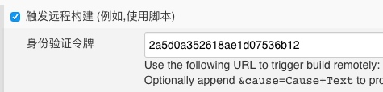
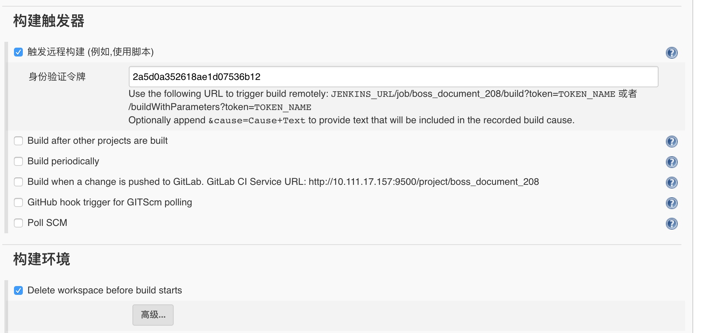

# gitlab触发Jenkins 自动构建

## 参考
[持续集成之④:GitLab触发jenkins构建项目](https://www.cnblogs.com/reblue520/p/7146638.html)
[印象-link](https://app.yinxiang.com/shard/s9/nl/679699/02412e79-a809-4ed4-8f77-f13b43013e14/)
[gitlab利用webhook实现jenkins自动构建](http://www.jianshu.com/p/4eac43872b40)
[印象-link](https://app.yinxiang.com/shard/s9/nl/679699/1cea3479-0c5e-499f-a851-5165dd8cd351/)

## 配置
1. 插件  
[Gitlab Hook Plugin](https://wiki.jenkins.io/display/JENKINS/Gitlab+Hook+Plugin)  
[Build Token Root Plugin](https://wiki.jenkins.io/display/JENKINS/Build+Token+Root+Plugin)  
>如果没有安装Build Token Root Plugin，则在Test Hook时会报403错误

2. 简单配置  
 1. jenkins的部署配置选择“远程构建”选项，验证令牌可使用随机token  
生成随机token的命令`openssl rand -hex 12`  
      
 2. gitlab中配置“webhooks“  
url路径格式：`http://jenkins服务器地址:8080/buildByToken/build?job=项目名&token=token值`  
插件使用详情可查看[官网文档](https://wiki.jenkins.io/display/JENKINS/Build+Token+Root+Plugin)  


## 参考配置
Execute shell

``` bash
#!/bin/sh -ex

FILE_HOME=/usr/local/axure/workspace/git_home/

REMOTE_HOST=10.146.16.208

touch 数据更新日期_`date "+%Y-%m-%d_%H-%M-%S"`

# convert 2 pdf
mkdir doc_pdf
mkdir doc_html
mkdir xls_html
find . -name '*.doc*' -print0 |xargs -0 /usr/bin/libreoffice  --invisible --convert-to pdf --outdir 'doc_pdf'
find . -name '*.doc*' -print0 |xargs -0 /usr/bin/libreoffice  --invisible --convert-to html --outdir 'doc_html'
find . -name '*.xls*' -print0 |xargs -0 /usr/bin/libreoffice  --invisible --convert-to html --outdir 'xls_html'

ssh $REMOTE_HOST "rm -rf ${FILE_HOME}*"

scp -r * $REMOTE_HOST:$FILE_HOME

ssh $REMOTE_HOST "chmod -R 755 ${FILE_HOME}"

```



