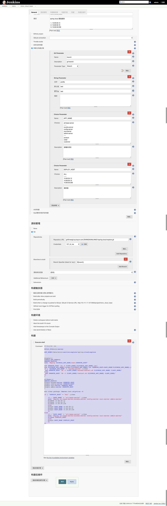

# jenkins配置备份

## jenkins 标准配置

```bash
APP_NAME=$module-1.0-SNAPSHOT.jar

TARGET=/root/datamap/apps/$module/$APP_NAME

JVM_OPTS=" -Duser.timezone=GMT+08 -server -Xms4G -Xmx4G -XX:MaxMetaspaceSize=256M -XX:MetaspaceSize=256M -Xloggc:${logs}/gc.log -XX:-PrintGCDetails -XX:+PrintGCDateStamps -XX:+PrintGCApplicationStoppedTime -XX:+UseConcMa
rkSweepGC -XX:CMSInitiatingOccupancyFraction=70  -XX:+UseCMSCompactAtFullCollection -XX:+CMSParallelRemarkEnabled -XX:+HeapDumpOnOutOfMemoryError"

#=======

mvn clean package -Dmaven.test.skip=true

cp $module/target/$APP_NAME $TARGET


pid=`ps -ef | grep -v grep | grep "$TARGET" |  awk '{print $2}'`

if [ -n "$pid" ]
then

echo kill pid:$pid

kill -9 $pid
fi

#=======

cd /root/datamap/apps/$module
MOCKTIME_ARG=""

if [ -n "$MOCK_CUR_TIME" ]
then

echo MOCK_CUR_TIME:$MOCK_CUR_TIME
MOCKTIME_ARG="-DMOCK_CUR_TIME=$MOCK_CUR_TIME"

fi
# BUILD_ID 用来防止线程退出
BUILD_ID=$APP_NAME nohup java $MOCKTIME_ARG -jar $TARGET --spring.profiles.active=dev >/root/apps/$module/console.log 2>&1 &
```

## spring cloud的集群配置

预览图

jenkins的执行脚本

```bash
#!/bin/sh -ex

BUILD_ID=micro-server

APP_HOME=/data/micro-service-explore/spring-cloud-explore

ARGS="'-Xms64m -Xmx64m'"

Single(){
SINGLE_APP_NAME=$1
REMOTE_HOST=$2
echo "deploy $SINGLE_APP_NAME,host:$REMOTE_HOST"

ssh $REMOTE_HOST "rm -f ${APP_HOME}/${SINGLE_APP_NAME}.jar"
scp ${SINGLE_APP_NAME}/target/${SINGLE_APP_NAME}.jar $REMOTE_HOST:$APP_HOME/${SINGLE_APP_NAME}.jar
if [ "$SINGLE_APP_NAME" = "eureka-server" ];then
 ssh $REMOTE_HOST "sh -l ${APP_HOME}/eureka-restart.sh ${SINGLE_APP_NAME} ${APP_HOME} ${ARGS}"
else
 ssh $REMOTE_HOST "sh -l ${APP_HOME}/restart.sh ${SINGLE_APP_NAME} ${APP_HOME} ${ARGS}"
fi
}

AllBase(){
REMOTE_HOST=$1
Single eureka-server $REMOTE_HOST
Single config-server $REMOTE_HOST
Single zuul-server $REMOTE_HOST
Single admin-server $REMOTE_HOST
}

mvn clean package -Dmaven.test.skip=true -U

if [ "$DEPLOY_HOST" = "ALL" ];then

    if [ "$APP_NAME" = "all-base-server" ];then
    echo "deploy all-base-server:eureka-server config-server zuul-server admin-server"
    AllBase 10.69.59.13
    AllBase 10.69.56.19
    AllBase 10.69.59.236
    else
    Single $APP_NAME 10.69.59.13
    Single $APP_NAME 10.69.56.19
    Single $APP_NAME 10.69.59.236
    fi
else
    if [ "$APP_NAME" = "all-base-server" ];then
    echo "deploy all-base-server:eureka-server config-server zuul-server admin-server"
    AllBase $DEPLOY_HOST
    else
    Single $APP_NAME $DEPLOY_HOST
    fi
fi

```

机器上的启动脚本

restart.sh

```bash
#!/bin/sh

APP_NAME=$1
APP_HOME=$2
ARGS=$3

echo $APP_NAME
echo $APP_HOME

pkill -9 -f $APP_NAME.jar || echo noProcess
cd $APP_HOME
#nohup确保不会中断
nohup java $ARGS -jar $APP_NAME.jar --logging.file=logs/$APP_NAME.log >/dev/null 2>&1 &
```

eureka-restart.sh

```bash
#!/bin/sh

APP_NAME=$1
APP_HOME=$2
ARGS=$3

echo $APP_NAME
echo $APP_HOME

pkill -9 -f $APP_NAME.jar || echo noProcess
cd $APP_HOME
#nohup确保不会中断
nohup java $ARGS -jar $APP_NAME.jar --spring.profiles.active=peer1 --logging.file=logs/$APP_NAME.log >/dev/null 2>&1 &
```