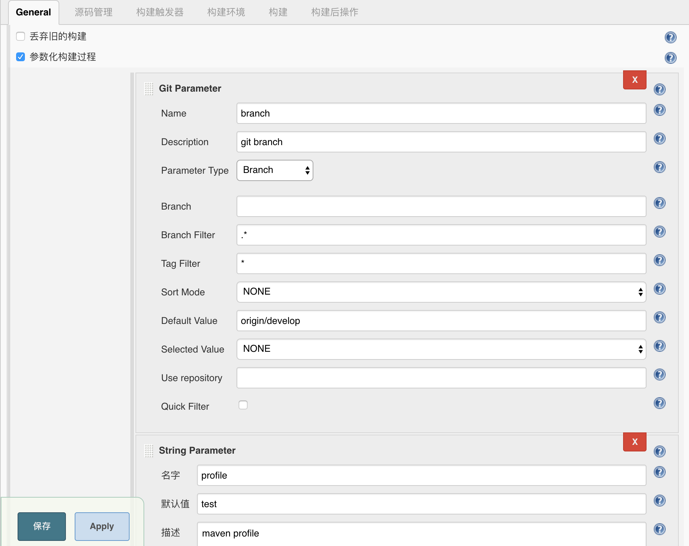
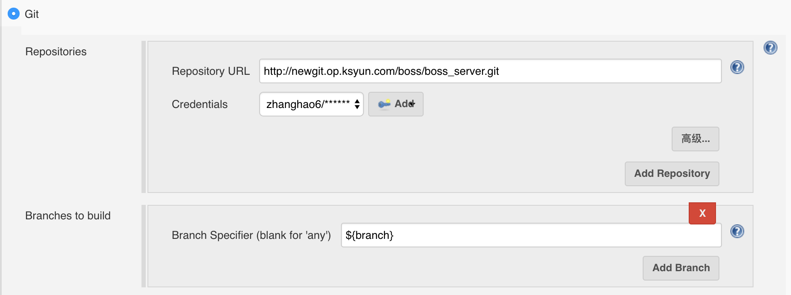

# 安装与使用
[TOC]

## 环境的安装

### 安装git
如果git的版本过低，在配置jenkins时可能会出现`The requested URL returned error: 401 Unauthorized while accessing`这样的错误，这是因为git版本过低

**从源码安装git**[参考](https://git-scm.com/book/zh/v1/%E8%B5%B7%E6%AD%A5-%E5%AE%89%E8%A3%85-Git)
1. 安装git的依赖(使用yum或apt-get)

``` shell
$ yum install curl-devel expat-devel gettext-devel \
  openssl-devel zlib-devel

$ apt-get install libcurl4-gnutls-dev libexpat1-dev gettext \
  libz-dev libssl-dev
```
如果在后面的编译源码时提示错误

```
Can't locate ExtUtils/MakeMaker.pm in @INC (@INC contains: /usr/local/lib64/perl                                                                             5 /usr/local/share/perl5 /usr/lib64/perl5/vendor_perl /usr/share/perl5/vendor_pe                                                                             rl /usr/lib64/perl5 /usr/share/perl5 .) at Makefile.PL line 3.
BEGIN failed--compilation aborted at Makefile.PL line 3.
```
那么还需要安装如下依赖

``` shell
$ yum install perl-ExtUtils-CBuilder perl-ExtUtils-MakeMaker
```

2.从[官网](http://git-scm.com/download)下载源码后编译安装

``` shell
$ tar -zxf git-1.7.2.2.tar.gz
$ cd git-1.7.2.2
$ make prefix=/usr/local all
$ sudo make prefix=/usr/local install
```
`prefix`指定了安装目录，如果安装后没有找到git命令，检查PATH系统变量（`echo $PATH`）是否配置了`/usr/local/bin`

### 安装maven
略

## 安装jenkins
1. 从[官网](https://jenkins.io/download/)下载jenkins并部署
2. 启动jenkins安装对应插件  
如果没有网络可离线下载（官网有）后上传jenkins，但是离线安装插件需要先安装插件的依赖。  
另一种方法就是直接从其他jenkins复制插件过来，插件目录：`／root/.jenkins/plugins`

## 配置jenkins项目
可以通过参数化构建来传递参数，参数通过`${name}`的方式来调用。  


> ⚠️**注意**：
> 配置git分支的方式，在目前的jenkins下存在一个问题，如果是新建的项目并且还没有创建过工作空间，那么在构建项目时会发现无法拉取分支信息而报错，因此在配置中指定git分支参数之前，应该先用不传参数的方式（分支默认为master）来构建一次项目，创造出工作空间，在这之后去指定分支参数才能正常使用。


构建时传参数指定git分支和maven的profile
`branch`参数可以通过配置`Defalut Value`指定默认值


拉取git时使用参数


maven构建时使用参数`mvn clean package -Dmaven.test.skip=true -P${profile} -U`

maven构建参数

``` bash
BUILD_ID=boss-server-8080

APP_HOME=/opt/boss-server-8080

pwd
echo "use branch:"${branch}

mvn clean package -Dmaven.test.skip=true -P${profile} -U

############################################
# 3. 停止服务
#############################################
tpid=$(ps -ef |grep tomcat |grep -w $APP_HOME|grep -v 'grep'|awk '{print $2}')
#判断进程是否存在
if [ "$tpid" ];
        then
		${APP_HOME}/bin/shutdown.sh
		#杀掉进程
                kill -9 $tpid
        else
                echo "tomcat not start!"
fi

############################################
#4. 删除并拷贝
#############################################
rm -rf $APP_HOME/webapps/bossv2
rm -f $APP_HOME/webapps/bossv2.war

pwd

mv target/boss.war  $APP_HOME/webapps/bossv2.war

############################################
# 5. 启动服务
#############################################
${APP_HOME}/bin/startup.sh
```

maven 远程构建参数（scp到远程机器）

``` bash
#!/bin/sh -ex

BUILD_ID=tomcat8-ruleconvert

APP_HOME=/usr/local/tomcat-ruleconvert-9520

whoami

mvn clean package -Dmaven.test.skip=true -Pdev -U

ssh 10.4.25.68 "pkill -9 -f ${APP_HOME}"

# ssh 10.4.25.68 "ps -ef |grep tomcat-ruleconvert-9520 |grep -w ${APP_HOME}|grep -v 'grep'|awk '{print \$2}'|xargs kill -9 || echo noProcess"

ssh 10.4.25.68 "rm -rf ${APP_HOME}/webapps/ROOT ${APP_HOME}/webapps/ROOT.war"

scp target/convert.war 10.4.25.68:$APP_HOME/webapps/ROOT.war

ssh 10.4.25.68 "sh -l ${APP_HOME}/bin/startup.sh"
```

maven 使用代理机器远程构建脚本

``` bash
#!/bin/sh -ex

BUILD_ID=boss-ruleconverter-8100

APP_HOME=/opt/boss-ruleconverter-8100

REMOTE_HOST=10.111.84.141

SCP_API(){
scp -o ProxyCommand="ssh -A 10.69.57.76 -W %h:%p" web/api/target/api.war $REMOTE_HOST:$APP_HOME/webapps/ROOT.war
}

SCP_SUPPORT(){
scp -o ProxyCommand="ssh -A 10.69.57.76 -W %h:%p" web/support/target/support.war $REMOTE_HOST:$APP_HOME/webapps/support.war
}

RM_API(){
ssh 10.69.57.76 "ssh $REMOTE_HOST 'rm -rf ${APP_HOME}/webapps/ROOT ${APP_HOME}/webapps/ROOT.war'"
}

RM_SUPPORT(){
ssh 10.69.57.76 "ssh $REMOTE_HOST 'rm -rf ${APP_HOME}/webapps/support ${APP_HOME}/webapps/support.war'"
}

echo "build by DEV,you branche is "${branch}\
"<br>Time: "`date "+%Y-%m-%d %H:%M:%S"` 
#>src/main/webapp/branch.html

mvn clean package -Dmaven.test.skip=true -P${profile} -U

ssh 10.69.57.76 "ssh $REMOTE_HOST "pkill -9 -f ${APP_HOME}" || echo noProcess"


if [ "$app" = "all" ];then
echo "deploy all"
RM_API
RM_SUPPORT
SCP_API
SCP_SUPPORT

fi

if [ "$app" = "api" ];then
echo "deploy api"
RM_API
SCP_API
fi

if [ "$app" = "support" ];then
echo "deploy support"
RM_SUPPORT
SCP_SUPPORT
fi

ssh 10.69.57.76 "ssh $REMOTE_HOST "sh -l ${APP_HOME}/bin/startup.sh""
```

## jenkins的使用中的问题

如果在执行构建时发现提示mvn命令不存在等问题，先检查系统的`PATH`参数是否有对应的路径。然后可检查jenkins的环境变量，jenkins有自己的环境变量，可在`系统管理-系统信息`中查看，如果jenkins环境变量`PATH`中确实不存在该路径，尝试重启jenkins重新加载环境变量


