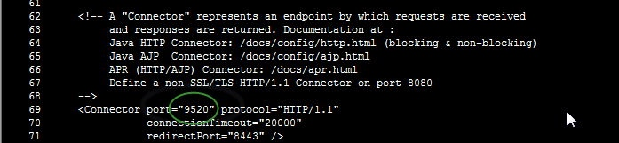
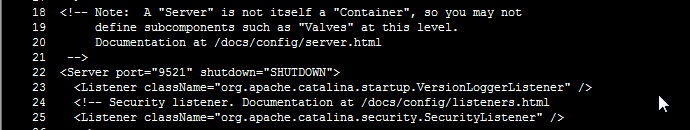

## tomcat目录规范
规则如下：tomcat-[业务名字]-[端口]-[节点号]
> 单机单实例时，节点号为空。多实例，需要节点号。

如：

```
tomcat-jenkins-9400
tomcat-demo-9530-1
tomcat-demo-9540-2
tomcat-demo-9550-3
```

## tomcat端口规范

要使用较为连续的端口号，符合一定的规律。如下：

```
正例：
tomcat-demo1-9530 所需要的端口 9530、9531、9532
tomcat-demo2-9540 所需要的端口 9540、9541、9542
tomcat-demo3-9550 所需要的端口 9550、9551、9552
反例：
tomcat-demo1-9530 所需要的端口 9530、9500、9510【避免不规律命名】
tomcat-demo2-9540 所需要的端口 8989、8006、8010【避免不规律命名】
tomcat-demo3-9550 所需要的端口 9550、9750、9850【避免不规律命名】
```

## tomcat端口修改
在自定义端口或单机多实例部署时，需要修改server.xml文件中的Connector Port、shutdown，AJP端口。具体如下：

大约69行处修改 **start端口** 如下所示的 **9520端口**：



大约22行处修改 **shutdown端口** 如下所示的 **9521端口**：




大约91行处修改 **AJP端口** 如下所示的 **9522端口**：


