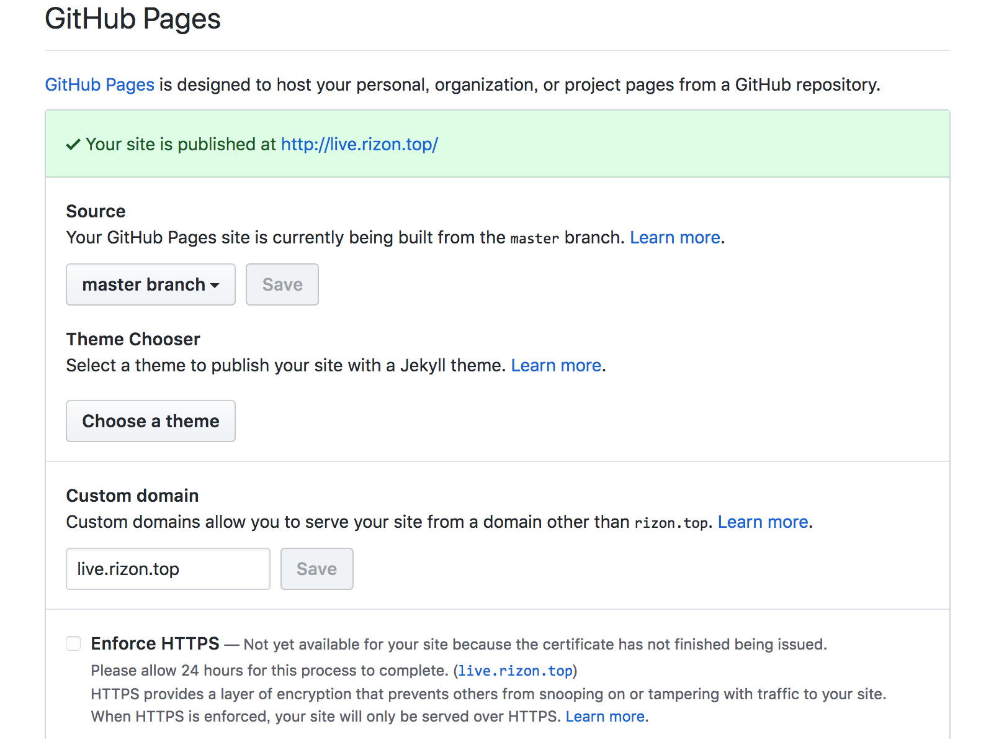
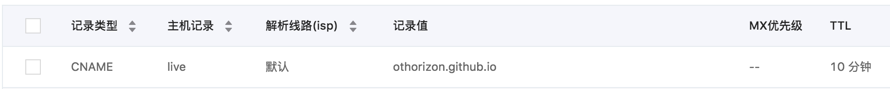

# notelive 开发 札记

- [notelive 开发 札记](#notelive-开发-札记)
    - [背景](#背景)
    - [技术栈](#技术栈)
    - [部署方案](#部署方案)
        - [前端部署](#前端部署)
        - [后端部署](#后端部署)
            - [pm2管理项目](#pm2管理项目)
    - [参考资料](#参考资料)
    - [一些零碎的知识点](#一些零碎的知识点)

## 背景

之前采用leancloud+html页面写了一个简单的在线记事本工具，[note.rizon.top](note.rizon.top)。现在得空准备重写该项目。一方面，之前因为受限于没有后台服务的纯前端页面因此无法实现更复杂的功能，所以这次准备在功能上进行一次迭代升级。另一方面，也是为了学习新的框架。这次采用的框架是 mongodb+nodejs+express+html，之所以这么选一方面这是市面上常见的方案，另一方面这些都是我没接触过的东西，后者原因最重要咯。

## 技术栈

docker：mongodb采用docker部署  

数据库：mongodb 原因是存储json对象方便，毕竟只是个轻量级的小项目  

前端：html，会使用lodash的throttle函数来进行函数节流，参考：[debounce与throttle区别](https://blog.csdn.net/ligang2585116/article/details/75003436)  

后端：nodejs 使用express框架。express框架封装了http模块，使得开发后台服务变得更简单。  

## 部署方案

前端部署到到支持静态网站的代码托管平台，比如国内的coding，国外的github page。  
后台代码部署到自己的云服务器上，mongodb数据库使用docker部署。后端与mongodb为内网连接。

### 前端部署

1.配置托管
本次前端代码部署到github pages。
push前端代码到github之后，打开repository->settings，往下翻找到GitHub Pages，开启服务，默认给你提供了一个username.github.io的三级域名，这里我们绑定自定义域名（Custom domain）。

2.配置域名解析
保存后，打开你购买的域名的管理后台，配置域名解析，有两种配置方案一个是CNAME一个是A记录，A记录的对应IP可以查看githubpages的帮助文档，这里采用CNAME配置，比较简单。


### 后端部署

1.docker部署mongodb数据库
安装好docker环境，安装帮助可以参考：[centos常用环境安装#安装docker](https://rizon.top/tech/centos%E7%8E%AF%E5%A2%83%E5%AE%89%E8%A3%85/#%E5%AE%89%E8%A3%85docker-docker-ce)
1）拉取mongo镜像`docker pull mongo`
2）启动镜像`docker run -d --name notelive-mongo --hostname notelive-mongo -p 127.0.0.1:8807:27017 mongo`
`-d`参数后台运行,`-p 127.0.0.1:8807:27017`将容器内的27017端口绑定到宿主机的127内网ip的8807端口上，这样在机器上就可以用8807端口访问服务，而且即使当你的8807端口可以外网访问，也无法在外网请求到该服务。
3）部署后台代码，npm安装依赖
简单的启动服务方案是直接node命令启动:`PORT=8805 AllowOrigin=http://live.rizon.top nohup node ./bin/www >>log.log 2>&1 &`,写入环境变量并将日志重定向到文件后在后台运行服务。

好一些的方案是借助pm2工具管理服务,

#### pm2管理项目

参考：
[pm2使用心得](https://blog.csdn.net/frankenjoy123/article/details/73460055)
[使用PM2来部署nodejs项目](https://www.jianshu.com/p/d2a640b8661c)
[pm2配置文件介绍 - CSDN博客](https://blog.csdn.net/ningzheyuan/article/details/80590773)
[PM2实用入门指南 - 程序猿小卡 - 博客园](https://www.cnblogs.com/chyingp/p/pm2-documentation.html)

>全局安装pm2`npm install -g pm2`
启动服务`pm2 start ./bin/server.js`
查看所有服务`pm2 list`
查看服务详情`pm2 show <id|name>`
查看日志 `pm2 logs <id|name> [--lines 1000]`

`pm2 startOrRestart ./app.json` 通过配置文件启动

```json
{
  "apps": [
    {
      "name": "notelive",
      "max_memory_restart": "100M",
      "script": "./bin/server",
      "log_date_format": "YYYY-MM-DD HH:mm:ss",
      "out_file": "./logs/out.log",
      "error_file": "./logs/error.log",
      "instances": 2,
      "exec_mode": "cluster",
      "env": {
        "NODE_ENV": "production",
        "PORT": 8805,
        "AllowOrigin": "http://live.rizon.top"
      },
      "env_dev": {
        "NODE_ENV": "develop",
        "PORT": 8808,
        "AllowOrigin": "*",
        "mongo":{
          "url": "mongodb://localhost:8907/",
          "db": "demo",
          "col": "note"
        }
      }
    }
  ]
}
```

`env`为默认的环境配置（生产环境），`env_dev`、`env_test`来指定不同环境的环境变量配置，通过参数`--env`指定环境：`pm2 start app.js --env dev`

## 参考资料

mongodb：
[Node.js 连接 MongoDB | 菜鸟教程](http://www.runoob.com/nodejs/nodejs-mongodb.html)
[Node.js MongoDB](https://www.w3schools.com/nodejs/nodejs_mongodb.asp)

nodejs：
[Nodejs进阶：用debug模块打印调试日志 - 程序猿小卡的前端专栏 - SegmentFault 思否](https://segmentfault.com/a/1190000009183793)

## 一些零碎的知识点

1. JavaScript的函数声明与函数表达式的区别

```javascript
    // 1,函数声明(Function Declaration)
    function funDeclaration(type){
        return type==="Declaration";
    }
    // 2,函数表达式(Function Expression)。
    var funExpression = function(type){
        return type==="Expression";
    }
```

Javascript 中函数声明和函数表达式是存在区别的，函数声明在JS解析时进行函数提升，因此在同一个作用域内，不管函数声明在哪里定义，该函数都可以进行调用。而函数表达式的值是在JS运行时确定，并且在表达式赋值完成后，该函数才能调用。来源：[JavaScript的函数声明与函数表达式的区别](https://www.cnblogs.com/xbj-2016/p/5903611.html)
2. js异步函数同步调用 Promise

[Node.js的那些坑（三）——如何在异步方法都执行后再执行 - CSDN博客](https://blog.csdn.net/duzixi/article/details/53842182)
[JS - Promise使用详解--摘抄笔记 - sweeeper - 博客园](https://www.cnblogs.com/sweeeper/p/8442613.html)