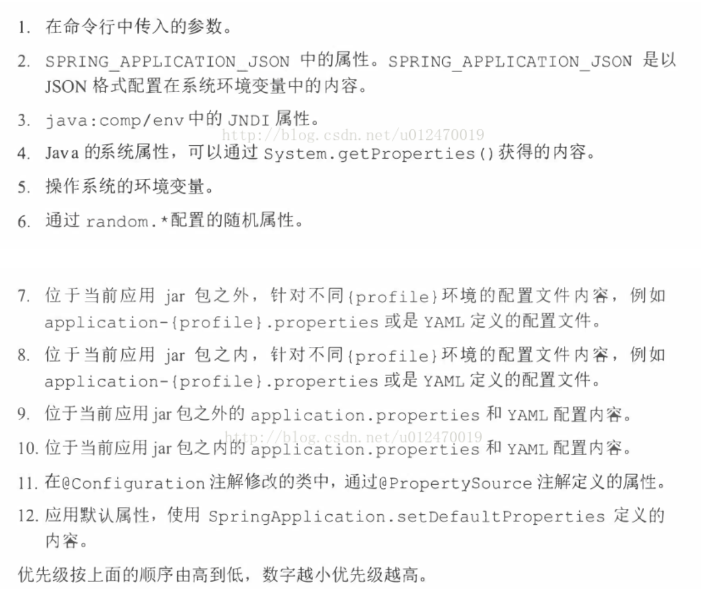

# spring cloud

## 参考资料

### spring cloud 优质教程集合

- [spring-boot-admin基础搭建教程](https://www.jianshu.com/p/33f9f5aae95b)

- [springboot学习资料汇总 - 纯洁的微笑博客](http://www.ityouknow.com/springboot/2015/12/30/springboot-collect.html)
- [springcloud学习资料汇总-纯洁的微笑博客](http://www.ityouknow.com/springcloud/2016/12/30/springcloud-collect.html)
- [spring-boot-纯洁的微笑博客](http://www.ityouknow.com/spring-boot.html)
- [Spring Cloud 简单教程 持续更新中 - 搜云库](https://segmentfault.com/a/1190000012648038)
- [史上最简单的 SpringCloud 教程](http://blog.csdn.net/forezp/article/details/70148833)

### 其他资料

- [Spring Cloud Eureka 常用配置及说明](https://www.cnblogs.com/li3807/p/7282492.html)
- [非Spring Boot Web项目 注册节点到Eureka Server并提供服务 - CSDN博客](http://blog.csdn.net/songmaolin_csdn/article/details/77880324)
- [使用spring-boot-admin对spring-boot服务进行监控](http://www.ityouknow.com/springboot/2018/02/11/spring-boot-admin.html)
- [为你的spring cloud微服务添加宕机邮件通知/服务报警](http://blog.csdn.net/rickiyeat/article/details/73228713)
- [从零开始，轻松搞定SpringCloud微服务系列 - 千万之路刚开始 - 博客园](http://www.cnblogs.com/hyhnet/p/7998751.html)
- [项目改造接入Spring Cloud流程](http://blog.csdn.net/xinluke/article/details/68064599)
- [微服务架构的基础框架选择：Spring Cloud还是Dubbo？ - CSDN博客](http://blog.csdn.net/kobejayandy/article/details/52078275)
- [spring cloud bus 扩展消息总线方法](https://www.jianshu.com/p/093ed9816993)

#### fegin http请求工具，Feign使得 Java HTTP 客户端编写更方便

- [Feign真正正确的使用方法](https://www.jianshu.com/p/3d597e9d2d67)
- [Feign基础教程 - CSDN博客](http://blog.csdn.net/u010862794/article/details/73649616)

## 学习笔记

### 监控

`Spring Boot Admin` 是一个管理和监控Spring Boot 应用程序的开源软件。每个应用都认为是一个客户端，通过HTTP或者使用 Eureka注册到admin server中进行展示，Spring Boot Admin UI部分使用AngularJs将数据展示在前端。[使用spring-boot-admin对spring-boot服务进行监控](http://www.ityouknow.com/springboot/2018/02/11/spring-boot-admin.html)

### 网关服务

提供一个对外的统一api接口，使外部的服务可以通过正常的http请求来访问注册到服务中心的服务
请求方式：`{网关的host}:{port}/{注册到服务中心的application-name 小写}/REQUEST PATH` eg:`http://koyou.top:8020/customer-service/getNeoHello`

### spring mvc 注册到spring cloud中

[非Spring Boot Web项目 注册节点到Eureka Server并提供服务 - CSDN博客](http://blog.csdn.net/songmaolin_csdn/article/details/77880324)

### 配置中心


可以使用消息总线，即借助mq来分发通知配置文件的修改。
也可以不使用总线，则每个client需要手动触发`/refresh`事件来重新获取配置

#### 不使用消息总线

[springcloud(七)：配置中心svn示例和refresh - 纯洁的微笑博客](http://www.ityouknow.com/springcloud/2017/05/23/springcloud-config-svn-refresh.html)
1.客户端添加`spring-boot-starter-actuator`依赖,该包具有一套完整的监控，其中包括一个`/refresh`功能
2.需要给加载变量的类上面加载`@RefreshScope`,在客户端执行`/refresh`(**POST请求**)的时候就会更新此类下面的变量值
3.添加配置`management.security.enabled=false`关闭安全认证
4.配置变更后，客户端以post请求的方式来访问`http://localhost:8002/refresh`(`curl -X POST http://localhost:8002/refresh`)

#### 使用消息总线

[springcloud(九)：配置中心和消息总线（配置中心终结版）](http://www.ityouknow.com/springcloud/2017/05/26/springcloud-config-eureka-bus.html)
[Application Context ID 说明](http://www.itmuch.com/spring-cloud-code-read/spring-cloud-code-read-spring-cloud-bus/)
需要刷新消息的客户端添加依赖,该包提供了消息的发送和接受

```xml
<dependency>
    <groupId>org.springframework.cloud</groupId>
    <artifactId>spring-cloud-starter-bus-amqp</artifactId>
</dependency>
```

在任意配置了该依赖的客户端执行`/bus/refresh`即可以将配置更新消息通知给所有客户端。
如果需要指明具体更新配置的客户端则使用`/bus/refresh?destination=customers:8000`
**`destination`的值是各个微服务的ApplicationContext ID**，关于ApplicationContext ID可以在org.springframework.boot.context.ContextIdApplicationContextInitializer 类的getApplicationId() 方法中看到。默认应该是`${spring.application.name}:${server.port}`

### 消息总线

[Spring Cloud Bus中的事件的订阅与发布（一） - 掘金](https://juejin.im/post/5a83926c6fb9a063523df632)

#### 扩展消息总线/自定义消息总线配置

[spring cloud bus 扩展消息总线方法](https://www.jianshu.com/p/093ed9816993)
`spring cloud bus 扩展消息总线方法`文中存在一个问题，使用这种继承`AbstractBusEndpoint`和`BusAutoConfiguration`的方式来发送message会导致消息重复接收，以及导致原有的消息总件功能失效，
因此应该采用其它方式来发送消息，如下

```java
@Autowired
private ApplicationContext context;

@RequestMapping(value = "/config", method = RequestMethod.GET, produces = MediaType.APPLICATION_JSON_VALUE)
@ResponseBody
public JsonResult<String> test() {
    final String instanceId=context.getId();
    final TradeAppliedEvent event=new TradeAppliedEvent(this,instanceId,null);
    event.setTradeId("test trade id");
    event.setUserId("test user id");
    context.publishEvent(event);
    return new JsonResult<>("");
}
```

[**github 示例**](https://github.com/othorizon/spring-cloud-explore/tree/master/order/src/main/java/top/kou/order/bus)

### 坑点

#### eureka集群中replicas显示为unavailable

[spring cloud  unavailable-replicas - CSDN博客](http://blog.csdn.net/u012470019/article/details/77973156)

启动服务时虽然采用  --spring.profiles.active = peer1 指定了配置文件，但还是会从 application.properties 中取值，将application.properties的

``` preperties
eureka.client.register-with-eureka=false
eureka.client.fetch-registry=false
```

注释掉或者 在 application-peer1.properties 与 application-peer2.properties 中显示 指定 这两个属性值为true即可。

**spring cloud属性加载顺序:**会按照下图的优先级加载，如果第一层没有配置key的值则去第二层查找，如果配置了则不会继续查找该key的值，
**即低优先级的不会覆盖高优先级的值，只会补充没有配置的**。


#### eureka列表显示ip

[eureka的Instances status列表显示ip](http://breezylee.iteye.com/blog/2393447)
服务提供者配置

```properties
eureka.instance.prefer-ip-address=true
eureka.instance.instance-id=${spring.cloud.client.ipAddress}:${server.port}
```

## 非Boot项目 注册到spring cloud（eureka server） 提供服务

[spring-cloud-not-boot.md](spring-cloud-not-boot.md)