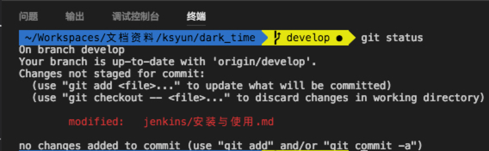

# Visual Studio Code 的使用

[TOC]

## 插件
>插件的快捷键配置、使用说明都在的首页中

- JSON Tools (eriklynd.json-tools)  
Tools for manipulate JSON. You can pretty/minify JSON with this extension.
- Git History (git log) (donjayamanne.githistory)  
View git log along with the graph and details.
- REST Client (humao.rest-client)  
REST Client allows you to send HTTP request and view the response in Visual Studio Code directly.
- SQL Beautify (sensourceinc.vscode-sql-beautify)  
格式化sql，人气较低，不太好用
- [Settings Sync](https://marketplace.visualstudio.com/items?itemName=Shan.code-settings-sync) 将vscode的设置同步到gist来存储

### markdown

- markdownlint  :语法提示
- Markdown All in One   :All you need for Markdown (keyboard shortcuts, table of contents, auto preview and more).
- Markdown Preview Enhanced :强推，md预览
- Markdown PasteURL ：快捷的粘贴url地址
- Markdown Paste    ：快捷的粘贴图片

## 个性化设置

>Settings File Locations
Depending on your platform, the user settings file is located here:
Windows `%APPDATA%\Code\User\settings.json`
Mac `$HOME/Library/Application Support/Code/User/settings.json`
Linux `$HOME/.config/Code/User/settings.json`

### 首选项-设置

>VSCode的设置是json形式的配置，做了图形化显示，设置分为用户设置和工作区设置，工作区设置就是保存在当前工作区的`settings.json`，用户设置则是全局的。自定义的设置是一个新的json配置文件，里面的配置会覆盖系统默认配置文件，所以不用担心修改错了东西而改不回去

``` json
{
    "rest-client.environmentVariables": {
        "local": {
            "host": "localhost",
            "token": "test token"
        },
        "production": {
            "host": "example.com",
            "token": "product token"
        }
    },
    "terminal.integrated.fontFamily": "'Meslo LG L DZ for Powerline'",
    "workbench.activityBar.visible": true,
    "java.errors.incompleteClasspath.severity": "ignore",
    "workbench.iconTheme": "vs-seti",
    "files.autoGuessEncoding": false,
    "workbench.editor.closeOnFileDelete": false,
    "gitHistory.showEditorTitleMenuBarIcons": false,
    "workbench.statusBar.feedback.visible": false,
    "pasteImage.path": "./media"
}
```

- terminal.integrated.fontFamily

    调整终端的字体，如果之前使用了oh-my-zsh的终端主题，该主题使用了Powerline的字体（有一些特殊符号），所以在vsCode集成的终端控制台也应该修改字体


- "files.hotExit": "onExit"

    是否允许热退出，即文件未保存的情况下也可以退出编辑器，下次打开会恢复，默认是允许的。

#### 其他首选项设置

- problems.decorations.enabled

    文件图标上显示错误信息的数字提示。The number of errors/warnings is shown in the decoration. The setting problems.decorations.enabled allows you to enable/disable the error/warning decorations.

### 首选项-键盘快捷方式

> 键盘快捷键设置也是json格式，与系统设置原理一样，默认打开是图形化界面，但是可以进入`高级自定义`修改`keybindings.json`文件
> 这里除了定义系统按键也可以定义插件（json设置中以extesion前缀）的按键设置，当然 插件的快捷键也可以在插件的首页里进行配置更为清晰

``` json
// 将键绑定放入此文件中以覆盖默认值
[
    {
        "key": "cmd+/",
        "command": "editor.action.triggerSuggest",
        "when": "editorHasCompletionItemProvider && editorTextFocus && !editorReadonly"
    },
    {
        "key": "ctrl+/",
        "command": "editor.action.commentLine",
        "when": "editorTextFocus && !editorReadonly"
    },
    {
        "key": "ctrl+d",
        "command": "editor.action.deleteLines",
        "when": "editorTextFocus && !editorReadonly"
    },
    {
        "key": "cmd+alt+l",
        "command": "editor.action.formatDocument",
        "when": "editorHasDocumentFormattingProvider && editorTextFocus && !editorReadonly"
    },
    {
        "key": "cmd+d",
        "command": "editor.action.copyLinesDownAction",
        "when": "editorTextFocus && !editorReadonly"
    },
    {
        "key": "ctrl+cmd+j",
        "command": "extension.prettyJSON"
    },
    {
        "key": "ctrl+cmd+m",
        "command": "extension.minifyJSON"
    },
    {
        "key": "cmd+.",
        "command": "-editor.action.quickFix",
        "when": "editorHasCodeActionsProvider && editorTextFocus && !editorReadonly"
    },
    {
        "key": "cmd+[Period]",
        "command": "editor.action.quickFix"
    },
    {
        "key": "ctrl+[Backquote]",
        "command": "workbench.action.terminal.toggleTerminal"
    }
]
```

### 任务配置

#### typescript的一键编译任务

```json
//自动运行tsc编译当前窗口的文件，并使用node命令来执行编译后的js文件
{
    "label": "Run tests",
    "type": "shell",
    "command": "(echo ${file}|awk -F '.' '{print $1}'|xargs tsc) && (echo ${file}|awk -F '.' '{print $1}'|xargs node)",
    "group": {
        "kind": "build",
        "isDefault": true
    },
    "presentation": {
        "reveal": "always",
        "panel": "shared"
    }
}
```