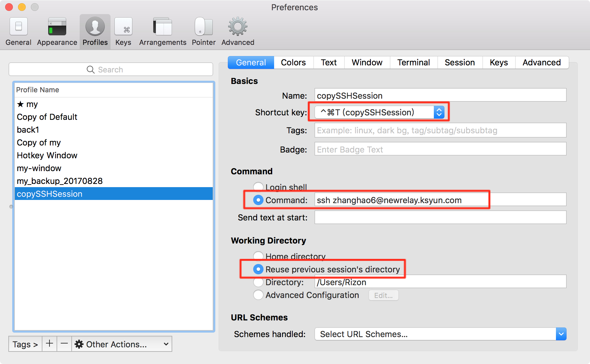

# Iterm2 使用

[TOC]

## 参考

- [iTerm2 与 Tmux 的整合](http://www.jianshu.com/p/f2e585453196)
- [iTerm2 for mac配置克隆会话功能 ](http://blog.itpub.net/29773961/viewspace-2143751/)
- [Mac端iTerms2实现Xshell的“复制SSH渠道”功能](http://www.jianshu.com/p/086d4b3cc00a)
- [Mac下iterm2 克隆会话功能](http://blog.csdn.net/zly9923218/article/details/52458161)

## 配置

### 实现session复制（会话复制）

1. 在`.ssh`目录下，修改（没有则新建） `config`文件

    ``` bash
    vi .ssh/config
     
    #添加如下内容
    #防止github被ssh记忆
    Host github.com other-exception.example.com
    ControlPath none

    Host *
    ControlMaster auto
    ControlPersist yes
    ControlPath ~/.ssh/master-%r@%h:%p
    ```
2. ITerm2 配置Profiles


解释：
- 配置不对github域名起作用，不然会影响使用sshkey来请求github。[ssh ControlMaster exceptions](https://unix.stackexchange.com/questions/122835/ssh-controlmaster-exceptions)
- ControlPersist为长连接，打开之后即使关闭了所有relay的ssh连接，一段时间内也能无需密码重新连接。可按时间配置,`ControlPersist 8h`这就是保持8小时
- ControlMaster配合ControlPath一起使用，当打开了一个relay的ssh连接之后，再次打开无需重复输入密码，但是关闭所有连接后，再次连接relay仍需输入密码。
- Compression为压缩选项，打开之后加快数据传输速度。`Compression yes`

参考：
[复制SSH会话,避免多次密码输入](https://www.topjishu.com/11051.html)
[复制SSH会话,避免多次密码输入-evernote](https://app.yinxiang.com/shard/s9/nl/679699/e39ff3a8-0172-4e3c-8491-dfac5b5939b1/)
[ssh省去重复输入密码](http://blog.csdn.net/xuanwu_yan/article/details/45666797)
[ssh省去重复输入密码-evernote](https://app.yinxiang.com/shard/s9/nl/679699/b7e80339-71b2-461f-b45d-194a6ef9b767/)

## local echo

解决ssh网速满，导致打字卡顿问题。
原因是 ssh时每个输入字符都会向远端发送数据，所以可以开启local ehco 和local line Editing。
详见：[ssh 打字卡顿 - SegmentFault 思否](https://segmentfault.com/q/1010000000150459)
可以使用mosh这个工具，[Mosh: the mobile shell](https://mosh.org/#usage)